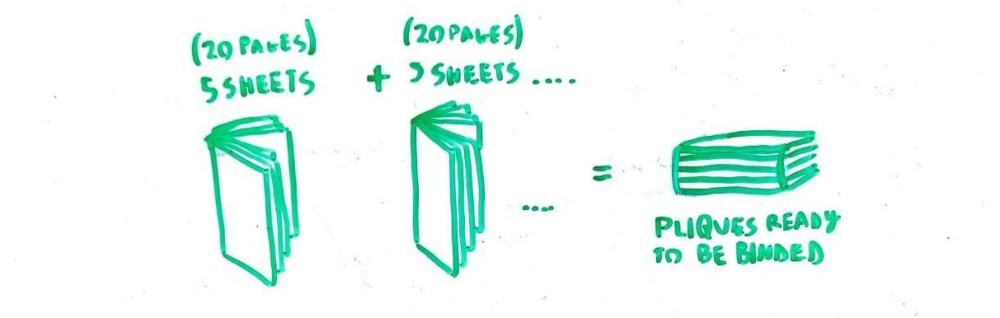
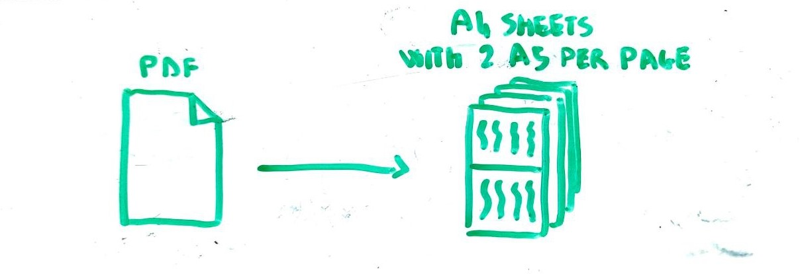

# BookletBinderPy
Python tools to convert pdf into ready-to-print booklet to bind into various dispositions.
Based on the libraries:
- pdf2image
- Pillow

## Working:
Specify the *pdf_name* and call one of these dunctions:
### booklet(pliques_len)

Convert the pdf into smaller booklets, print them, fold the booklets and bind them into the fool book.
Specify the *pliques_len* which is the number of pages every booklet should contain (recommended 10, or multiples of 4)

### -a4_to_2_a5()- NOT WORKING RIGHT NOW

Instead of having one page per A4, have 2 to save space! print it double face to reduce paper waste by 4!